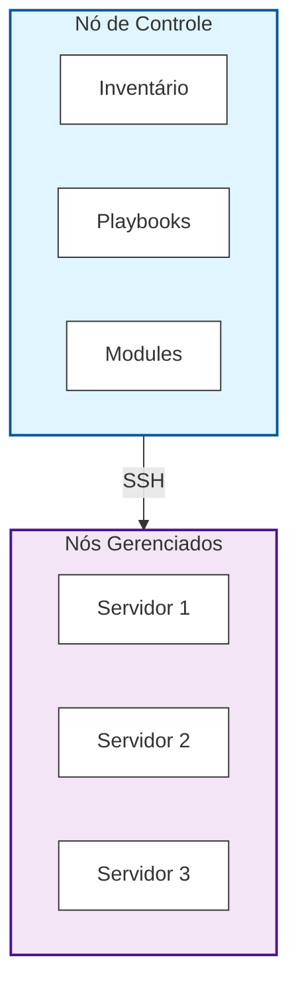

# Sobre o Ansible

O Ansible é uma ferramenta de automação de TI open-source que revolucionou a forma como gerenciamos infraestrutura.

## O que é o Ansible?

Ansible é uma plataforma de automação que permite:

- **Gerenciamento de Configuração:** Manter servidores no estado desejado
- **Provisionamento de Infraestrutura:** Criar e configurar recursos automaticamente
- **Orquestração de Aplicações:** Coordenar deploys complexos
- **Automação de Tarefas:** Eliminar trabalho manual repetitivo

---

## Características Principais

### 1. Agentless (Sem Agentes)

Diferente de outras ferramentas, o Ansible não requer instalação de agentes nos servidores gerenciados.
```mermaid
graph LR
    Control[Nó de Controle<br/>(Ansible)] -- SSH --> Server[Servidor 1<br/>(Sem agente)]
    
    %% Estilo opcional para destacar as caixas
    style Control fill:#f9f9f9,stroke:#333,stroke-width:2px
    style Server fill:#f9f9f9,stroke:#333,stroke-width:2px
```

### 2. Idempotente
Executar a mesma tarefa múltiplas vezes produz o mesmo resultado.

```yaml
# Este código pode ser executado 100 vezes
# O resultado será sempre o mesmo
- name: Garantir que Nginx está instalado
  apt:
    name: nginx
    state: present
```

### 3. Declarativo
Você define o que quer, não como fazer.
```yaml
# Você declara o estado desejado
- name: Nginx deve estar rodando
  service:
    name: nginx
    state: started
    enabled: yes
```

### 4. Baseado em SSH
Usa SSH para comunicação, aproveitando a infraestrutura existente.
```bash
# Ansible usa SSH padrão
ansible all -m ping

# Equivalente a: ssh user@host "comando"
```

## Por que usar Ansible?

### Simplicidade

- Sintaxe YAML fácil de ler
- Curva de aprendizado suave
- Não requer conhecimento de programação

### Poderoso

- Gerencia milhares de servidores
- Integra com cloud providers
- Extensível via plugins e modules

### Eficiente

- Execução paralela
- Conexões persistentes
- Otimizado para performance

## Casos de Uso

### 1. Configuração de Servidores

```yaml
- name: Configurar servidor web
  hosts: webservers
  tasks:
    - name: Instalar Nginx
      apt:
        name: nginx
        state: present
    
    - name: Copiar configuração
      template:
        src: nginx.conf.j2
        dest: /etc/nginx/nginx.conf
```

### 2. Deploy de Aplicações
```yaml
- name: Deploy da aplicação
  hosts: production
  tasks:
    - name: Baixar código
      git:
        repo: https://github.com/user/app.git
        dest: /var/www/app
    
    - name: Instalar dependências
      pip:
        requirements: /var/www/app/requirements.txt
  ```

### 3. Provisionamento de Cloud
```yaml
- name: Criar instância EC2
  hosts: localhost
  tasks:
    - name: Provisionar servidor
      ec2:
        key_name: mykey
        instance_type: t2.micro
        image: ami-12345678
        region: us-east-1
 ```

## Arquitetura do Ansible


